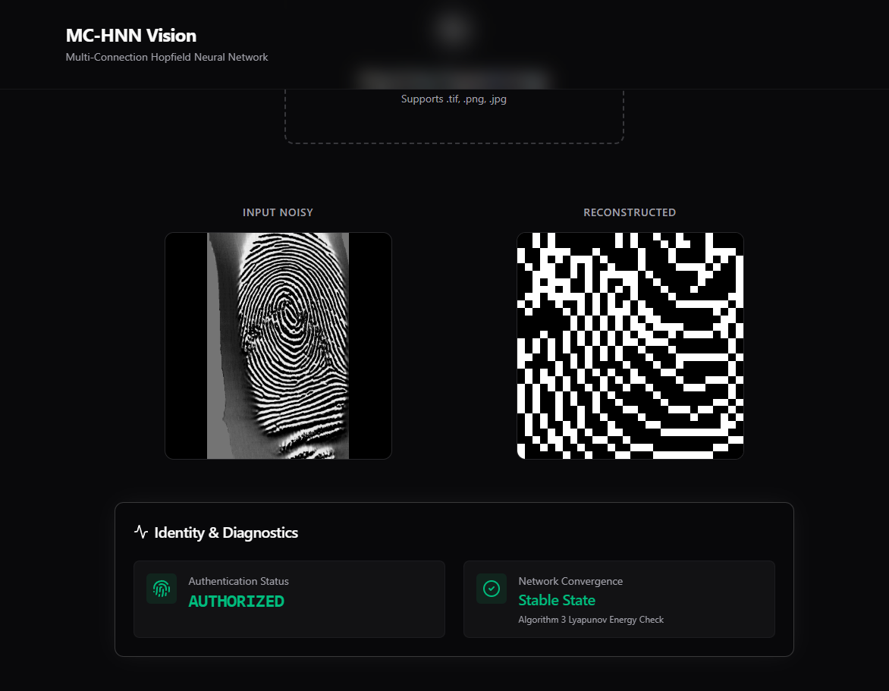
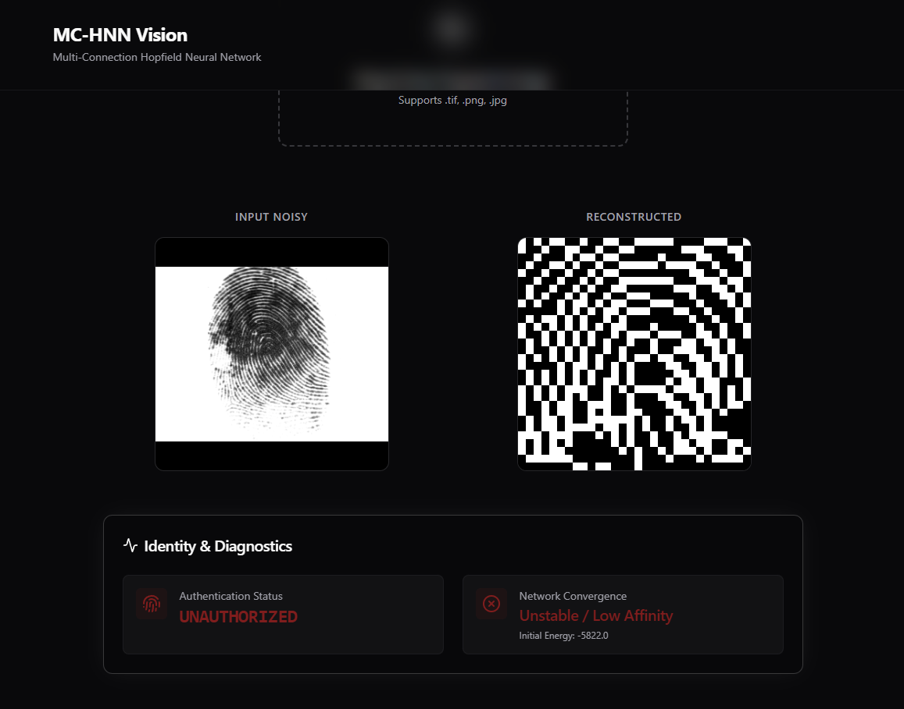
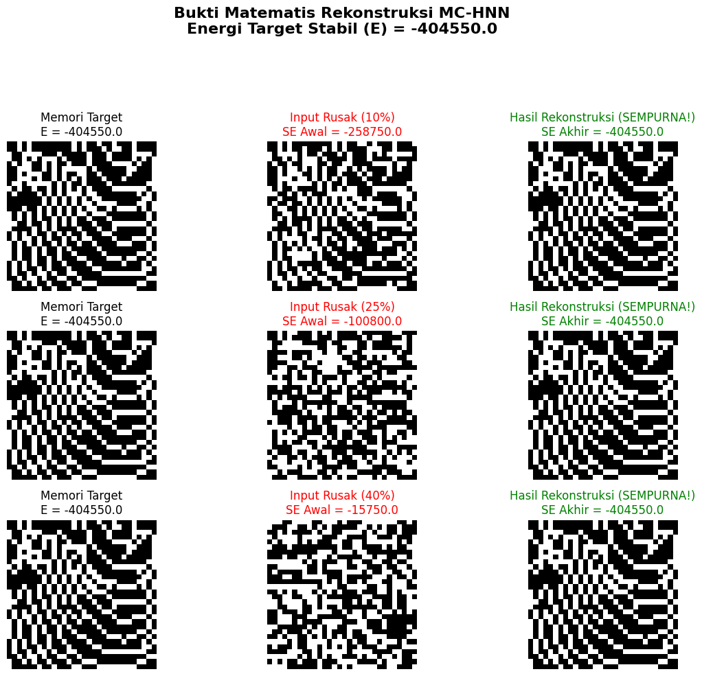
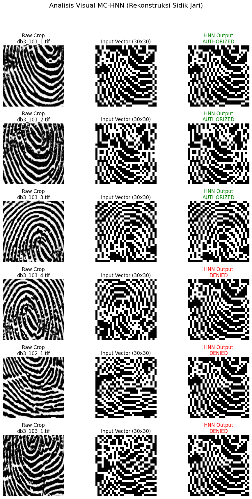
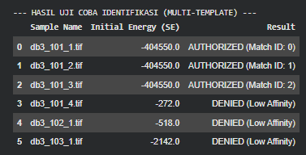

# MC-HNN Vision (Multi-Connection Hopfield Neural Network)

> A fingerprint recognition and reconstruction system that uses physics-based associative memory (Lyapunov Energy) to identify authorized users and reconstruct noisy fingerprint images.


---

## 📖 Introduction
This project was developed as a final assignment for the Artificial Neural Network course. It demonstrates the practical application of advanced Hopfield Neural Networks in biometric security, specifically focusing on fingerprint recognition and noisy pattern reconstruction.

## ⚙️ How It Works

### Etalon Arrays
To mitigate the common issue of cross-talk (spurious states) in standard Hopfield networks, this system utilizes **Etalon Arrays**. By storing orthogonalized memory patterns (golden standards), the network drastically improves its capacity and retrieval accuracy.

### Reconstruction via Lyapunov Energy Convergence
The network operates by interpreting the input fingerprint image as an initial state. It then iteratively updates its state to minimize the **Lyapunov Energy** of the system. The reconstruction process converges when the network reaches a stable, minimum-energy state corresponding to a stored memory pattern. A key highlight of this implementation is the stable target state characterized by a profound energy value of **`-404550.0`**.

### Authentication via Energy Affinity Threshold
Authentication is determined by calculating the Energy Affinity Threshold between the converged state and the original etalon patterns. 
- **Authorized:** The energy landscape safely converges to the target state.
- **Denied:** The pattern falls into local minima or fails to reach the required energy threshold, indicating an unrecognized or compromised fingerprint.

## 📊 Visual Analysis

### UI Preview (Authorized & Unauthorized)



### Mathematical Proof


### Visual Comparison


### Energy Logs


## 🚀 Installation & Deployment

### Local Development

1. **Clone the repository:**
   ```bash
   git clone <repository-url>
   cd <repository-directory>
   ```

2. **Backend (FastAPI):**
   ```bash
   cd src/backend
   pip install -r requirements.txt
   uvicorn main:app --reload
   ```

3. **Frontend (Next.js):**
   ```bash
   cd src/frontend
   npm install
   npm run dev
   ```

### Deployment
- **Frontend:** Deployed and hosted on **Vercel**.
- **Backend:** Deployed and hosted on **Render**.
- **Model Storage:** Large machine learning model artifacts are managed and stored using **Git LFS**.

## 📚 Credits, Dataset & References

### Dataset
The dataset used in this project is derived from the public **FVC2004 (Fingerprint Verification Competition)** dataset. The original images have been meticulously pre-processed (cropped, binarized, and skeletonized) to ensure optimal compatibility with the bipolar mapping requirements of the Hopfield network.

### References
This implementation is heavily inspired by and based on the foundational research presented in:
> **"A Robust Automatic Fingerprint Recognition System Using Multi-Connection Hopfield Neural Network"**  
> *Authors: Jay Kant Pratap Singh Yadav | Laxman Singh | Zainul Abdin Jaffrey*  
> [Read Paper (DOI: 10.18280/ts.390232)](https://www.iieta.org/journals/ts/paper/10.18280/ts.390232)

## ✍️ Author
- **FelienZ**
